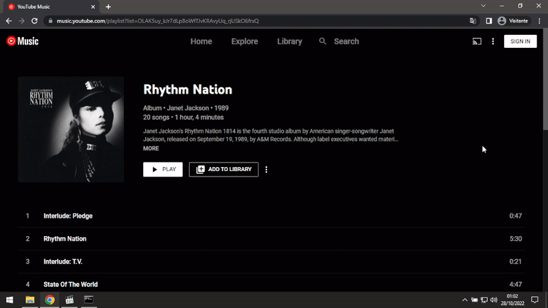

# Glomatico's YouTube Music Downloader
A Python script to download YouTube Music tracks with YouTube Music tags and audio quality up to 256kpbs AAC m4a.


## Basic usage
**Make sure to add ffmpeg to path and install "requirements.txt" with pip before running this program.**
```
/path/to/python gytmdl.py <url>
```
You can also use the `-i` argument to specify an itag (quality). Valid itags are 141 (256kbps AAC m4a), 251 (128bps Opus opus) and 140 (128kbps AAC m4a). Tracks are downloaded on a folder called "YouTube Music" at the current directory of the script. 

## Cookies
If you want to download age restricted tracks or download tracks on 141 format (AAC 256kbps), use this Chrome extension in YouTube Music's website to grab your cookie file: https://chrome.google.com/webstore/detail/get-cookiestxt/bgaddhkoddajcdgocldbbfleckgcbcid. You should save it as "cookies.txt" at the current directory of the script. A YouTube Premium subscription is required to download 141 itag tracks.
